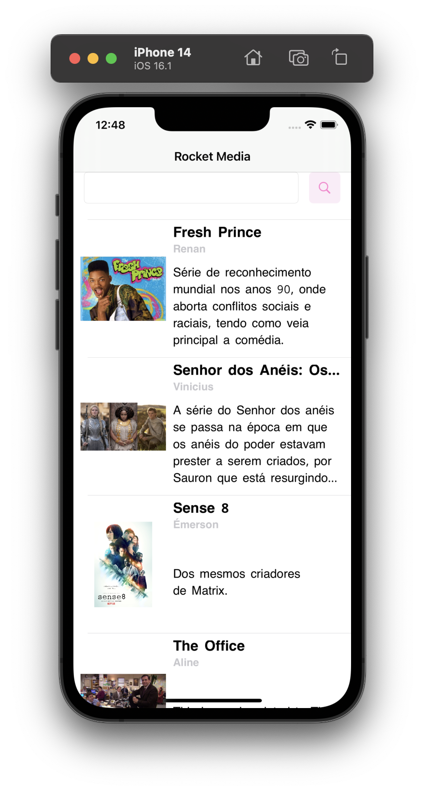
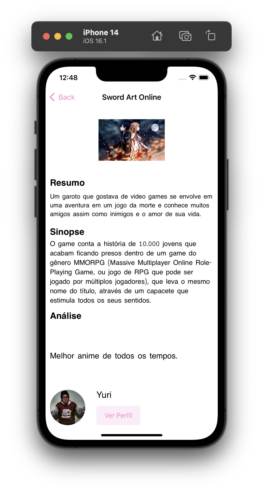
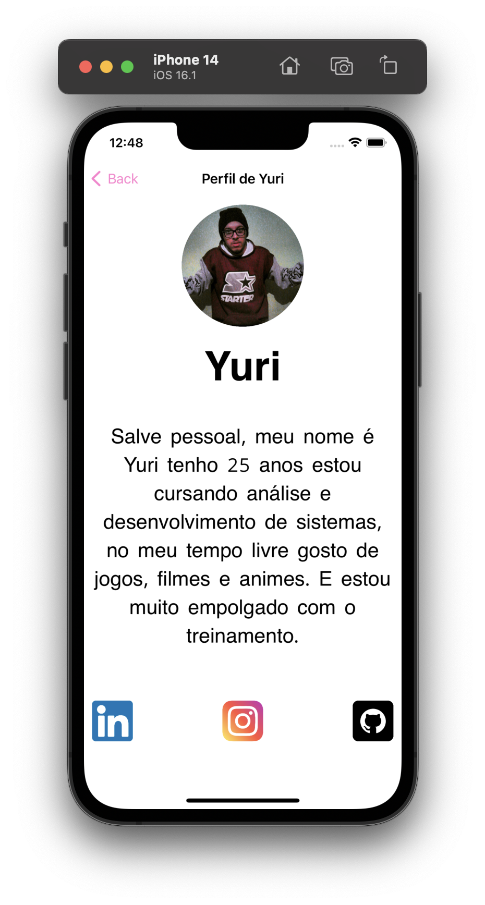

# Desafio Rocket Reviews

----

No desafio de hoje vocês devem implementar, em trio, um app para a exibição das análises das séries/animes que vocês fizeram no exercício de Git, lá no início do nosso curso.

Dentro desse projeto já tem um arquivo com funções que criam uma lista de `Media`'s com o devido `Author` que fez a análise. As imagens também já estão dentro do projeto.

Os tipos `Media`e `Author`, entretanto, não foram definidos. Dêem uma olhada no arquivo para entender como devem ser as estruturas.

# Tela Principal

    

A tela principal deve conter uma lista com informações resumidas das séries/animes. Cada elemento da lista deve possuir uma imagem, o título, nome do autor e o resumo.

Estabeleçam um tamanho máximo para o resumo, caso esse exceder deve truncar o texto apresentando reticências ao final.

Ao clicar num dos elementos deve ir para a próxima tela, a tela de detalhes.

## Bônus Points

Fazer uma barra de pesquisa para filtrar a lista de séries/animes, o filtro deve considerar:

- Nome da media
- Nome do autor

Ou seja, caso o texto de filtro seja parte do nome de um autor deve aparecer a série/anime que esse autor escreveu. Assim como se o texto de filtro for parte do título de qualquer media, deve aparecer elas.

**Dica**: procure sobre o método filter.

# Tela de Detalhes

    

A tela de detalhes deve possuir os dados completos da série/anime selecionada.

Deve possuir o título da série, uma imagem maior que a da tela principal, o resumo, a sinopse, a análise e uma parte final pra exibir o perfil do autor.

Nessa parte do autor deve exibir o avatar, o nome e um botão para ir a tela detalhada do perfil.

## Bônus Points

Utilizem uma scrollview para poder exibir as informações em tamanho suficientemente grande para o usuário ler.

# Tela do Perfil

    

Deve possuir o avatar maior do que na tela dos detalhes da mídia, além disso conter o nome e a descrição seguidos das redes sociais.

Pesquise no google como faz para acessar um endereço web a partir de um tap em um button.

# Bonus Points

Se não existir o endereço de determinada rede social deve esconder o botão correspondente.
